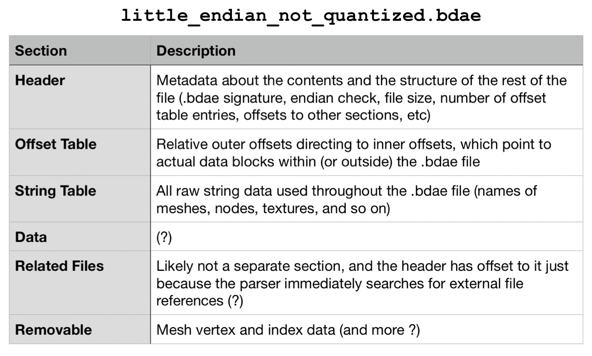
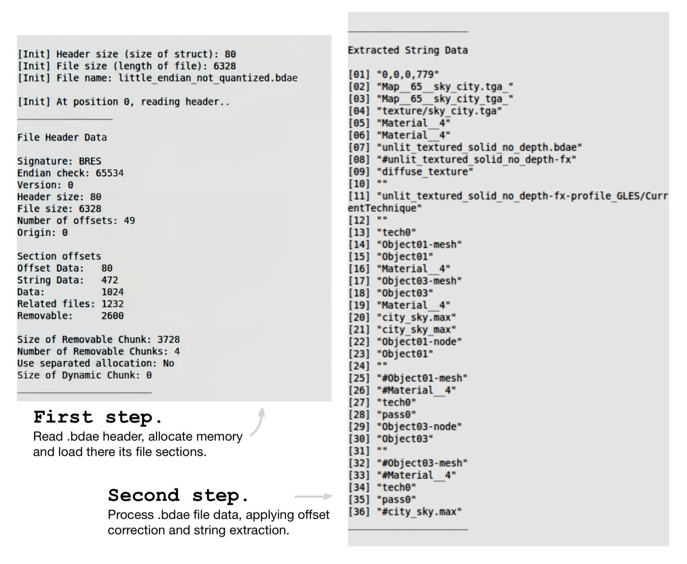

<!-- markdownlint-disable MD001 -->

# .BDAE File Format Parser and Viewer 📄

### Project overview

This project implements a 3D model viewer for .bdae file format, based on the .bdae parser from Gameloft’s game engine, and compiled into a standalone application. The parser loads the file sections into memory and processes file data, applying offset correction and extracting the strings that store the core information for rendering the 3D model. Originally borrowed from the source code of another Gameloft title, it has been modified to support the 64-bit .bdae file version 0.0.0.779 used in Order and Chaos Online v4.2.5. After reading the below documentation, you may clearly understand what is the .bdae file format, which is a result of my combined reverse-engineering and game-engine source code research.

### Main information

All game 3D models are stored in binary files of the `.bdae` format. They include __data for mesh, material, textures, nodes, bones, SFX, and animations__. BDAE stands for __Binary Digital Access Exchange__ and is a binary version of the DAE format, which itself is written in the XML language common for 3D models. The binary nature of .bdae files makes them superior in terms of size, runtime efficiency, and protection. When developers introduce new game assets, they run a dae2bdae script. __The developer of .bdae is Gameloft — it is used in their games and natively supported by their Glitch Engine__ (which itself is based on the [Irrlicht Engine](https://irrlicht.sourceforge.io/)). .bdae file format is not unified — each game uses a different version of it. Furthermore, each version has 4 subversions. The subversion is likely generated or updated automatically based on the configuration of the Glitch Engine.

Known information about .bdae file format is limited and located across a few forums. This is because __for reading and understanding these files you would have to do reverse-engineering__. For OaC .bdae files, this has been done in [Game Engine Filetypes Reverse Engineering](https://github.com/lOlbas/Game-Engines-Filetypes-Reverse-Engineering). That project provides a file-parsing template to view the structure of a .bdae file in a binary file editor like [010 Editor](https://www.sweetscape.com/010editor/). However, because this is a pure individual-file-based reverse engineering approach without having the game engine's source code as a reference, some 3D model data interpretations remain incomplete or incorrect.

Another problem is that not only can you not easily read and understand .bdae files, but more importantly, there is no convenient software to render the 3D models they contain. Several available tools you might find are based on custom-written plugins that are unstable; they may work on one .bdae version and fail on others. For the OaC .bdae file version, the only reliable option is [Ultimate Unwrap 3D Pro](https://www.unwrap3d.com/u3d/index.aspx), which does support the format, yet can only display a mesh, without any textures applied.

### BDAE file structure

Most likely, the .bdae file structure is based on the [Nintendo BRRES format](http://wiki.tockdom.com/wiki/BRRES_(File_Format)) (perhaps Gameloft got the format specs from Nintendo while developing for one of their platforms and kept it). It consists of 6 sections:

### BDAE file parser

The .bdae parser consists of:

- `resFile.cpp` – parser’s core implementation (explained below).
- `resFile.h` – parser's header file that declares the in-memory layout of the .bdae File object and its header structure.
- `access.h` – utility header that provides an interface for accessing loaded data either as a file-relative offset or as a direct pointer.
- `io` – input / output library that provides an interface for reading any game resource files from various sources (disk, memory, Gameloft's custom packed resource format, ZIP archives) with efficient memory management and reference counting. It is a part of the Glitch Engine, but has no dependencies on other engine modules.

 These files were taken from the Heroes of Order and Chaos game source code and reworked. Their .bdae parser was implemented as a utility module of the Glitch Engine, accessible under the `glitch::res` namespace. It is the absolute __entry point for a .bdae file in the game, performing its in-memory initialization__. When the world map loads, the very first step is to correctly load all game resources, and for .bdae files, this parser is responsible for that.

 My target was to build a parser independent of the Glitch Engine that would correctly parse .bdae files from the latest OaC version 4.2.5. In order to achieve this, the __parser had to be hardly modified: handled .bdae version difference (OaC uses v0.0.0.779 against v0.0.0.884 in HoC) and architecture difference (old OaC v1.0.3 and HoC .bdae files are designed to be parsed by a 32-bit game engine, while newer OaC 4.2.5 files expect a 64-bit game engine), Glitch Engine dependency removed, refactored and highly annotated__. Advanced explanation – it appears that inside a .bdae version there are 4 possible subversions / architecture configurations: big-endian 32-bit, big-endian 64-bit, little-endian 32-bit, and little-endian 64-bit. Attempting to parse a .bdae file of the wrong architecture would lead to undefined behavior, as 32-bit systems are written for a pointer size of 4 bytes, and in 64-bit systems it is 8 bytes, resulting in incorrect offsets. OaC v1.0.3 and HoC both use little-endian 32-bit .bdae files, while OaC v4.2.5 uses little-endian 64-bit (both of the .bdae version 0.0.0.79), i.e., the old parser is incompatible with the latest OaC .bdae files. This issue has been resolved.

__How does the .bdae parser work?__

Assume we opened the outer `some_model.bdae` archive file and there is a file `little_endian_not_quantized.bdae` inside it, which is the real file storing the 3D model data (see `main.cpp`), and so we opened this inner file as well. Now we call the initialization function `Init()`, which is split into 2 separate functions with the same name. __In the first function, we read the raw binary data from the .bdae file and load its sections into memory.__ Basically, it is the preparation step for the main initialization, since we don't do any parsing and just allocate memory and load raw data based on the values read from the .bdae header. __In the second function, we resolve all relative offsets in the loaded .bdae file, converting them to direct pointers to the data while handling internal vs. external data references, string extraction, and removable chunks.__ This is the main initialization step, after which we can quickly access any data of the 3D model.

Two concepts should be pointed out about the parser. I just mentioned internal and external data references with no comment of what they are. When you walk the offset table by iterating over each offset entry, an entry’s target may lie outside the bounds of the current .bdae file — this is called an _external_ reference. It's easy to guess what the _internal_ reference is. Well, these 2 scenarios have to be handled separately, and indeed the parser does so. To show the difference, I have to explain the second concept first. There is that file `access.h`, which makes it nice to work with offsets and pointers. The important things is that, after initialization, the in-memory .bdae File object is no longer laid out as it was on disk, so you cannot simply do origin + offset. Instead, __the only reliable way to find any data is via the offset table using the Access interface that replaces raw pointer arithmetic with a two‐layer abstraction: it uses outer and inner offsets__ (not to be confused with internal / external references). An offset table entry is an outer `Access<Access<int>>` object that stores the offset to an inner `Access<int>` object, which itself holds the offset to actual data. When parsing the offset table, a two-pass logic is used. In the first pass we process the outer offset, handling cases where it points to different sections of the .bdae file. In the second pass we process the inner offset, with minor changes in the logic, but we skip it for external references! Yes, because the inner offset would lead us outside of the .bdae file, and we don't want to initialize without knowing what we initialize. Reference file might not be loaded yet and must be initialized independently. See the code annotation for more detail.

### Manual

The project was implemented for my personal interest, though compiler / .bdae compatibility issues are not my concern. I was using the old C++ compiler version that was relevant during the development times of OaC. Although I do not recommend using, you may try to install it alongside your main compiler version and then switch between compiler versions at any time with `sudo update-alternatives --config g++`. Regardless, with newer compiler versions, the project should still compile with no errors. If you want to contribute, welcome to contact me or do a pull request.

Compatibility: __.bdae v0.0.0.779__  
Compiler: __g++ 4.2.1__  
OS: __Linux Mint 21.2__

Compile and launch  
`make`  
`./app`

There is a default file, `example.bdae`, which is a 3D model of a skybox from __OaC v4.2.5__. All .bdae models for this OaC version can be downloaded from my [Google Drive]((https://drive.google.com/file/d/1YU3rkmLSvIk_II3vxLlim_QSzsavEXnp/view?usp=drivesdk)).
