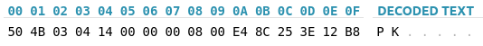
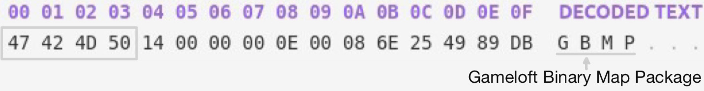
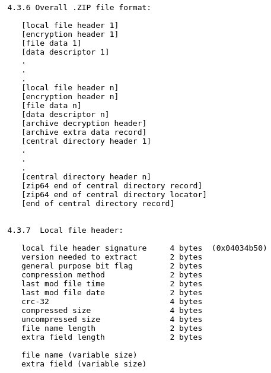

<!-- markdownlint-disable MD033 MD001 MD045 -->

# .BIN Archive Files Header Replacement

All game resource files are stored in (little-endian) binary files `.bin`, which are actually ZIP archives in disguise. While OaC version 1.0.3 opens them without issue, the latest version 4.2.5 uses some basic protection. If you simply rename them to `.zip`, you’ll get _“An error occurred while loading the archive”_. It appears Gameloft replaced the standard [zip local file header](https://pkware.cachefly.net/webdocs/casestudies/APPNOTE.TXT) signature 0x04034B50 with 0x504D4247. To fix this, we need a __script that scans a .bin file for all occurrences of that 4 byte sequence and replaces them with the original signature__.

### OaC 1.0.3

### OaC 4.2.5

 
 

### ZIP file header structure

